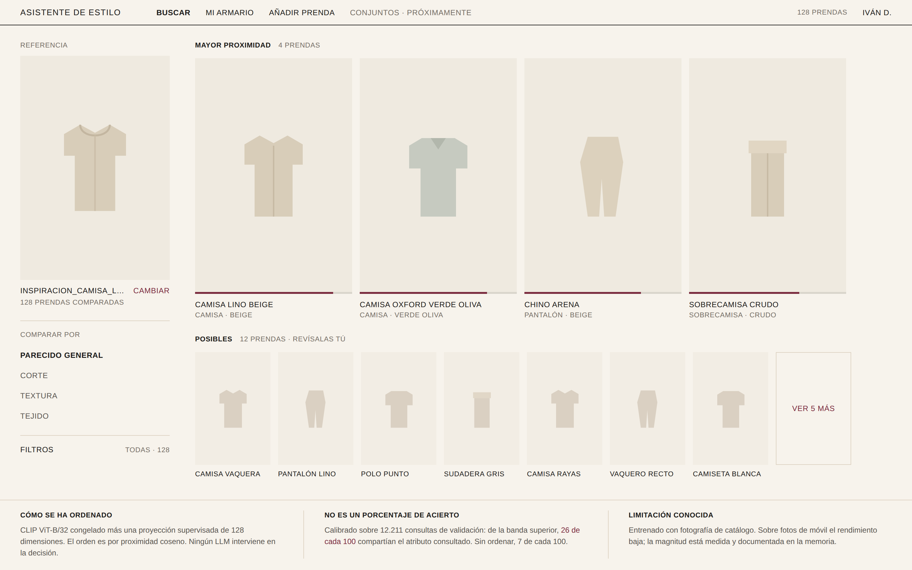

# Entrega 5 — Diseño del frontal y experiencia de usuario

> **ESQUELETO. El texto lo escribes tú.**
> Cada apartado lleva (a) lo que pide el enunciado, (b) el material del
> repositorio que le corresponde, con el número y el fichero de donde sale.
> Los bloques `ESCRIBE:` son tuyos. Borra estas indicaciones al terminar.
>
> Aviso: donde hay cifras, están medidas y tienen fichero. No las redondees
> hacia arriba ni las adornes. Si una no te cuadra, pregúntame antes de
> cambiarla.

---

## 1. Resumen de la solución y del usuario

*Pide: qué problema resuelve, quién es el usuario, qué necesidad concreta tiene,
qué tipo de producto es, y qué resultado obtiene del frontal. Sin repetir las
entregas anteriores.*

`ESCRIBE:` el problema en tus palabras, dos o tres frases.

**Material:**
- Tipo de producto según la lista del enunciado: **recomendador / explorador por
  recuperación**. No es un dashboard ni un predictor.
- Usuario: persona con un armario digitalizado que ve una prenda que le gusta y
  quiere saber qué tiene ya parecido. Alcance de producto: ropa de hombre.
- Resultado que obtiene: sus propias prendas ordenadas por proximidad a una
  imagen de referencia, en dos bandas con significado medido.
- Entrada: una imagen de referencia y, opcionalmente, la dimensión sobre la que
  comparar (parecido general, corte, textura, tejido).

`ESCRIBE:` la necesidad concreta. Sugerencia de ángulo, porque es el que el
tribunal entiende sin explicación: el problema no es tener poca ropa, es no
acordarse de la que ya se tiene.

---

## 2. Imagen mockup del frontal

`ESCRIBE:` un párrafo que recorra la pantalla señalando qué es cada zona.

**Material:**
- Exportada a 2880×1800 desde el canvas de diseño. Cuatro pantallas diseñadas:
  principal, detalle, alta de prenda y sin resultados.
- Sistema visual: estética de e-commerce de moda (rejilla, filetes de 1 px,
  tipografía con serif, imagen a sangre, sin tarjetas ni sombras). Paleta
  heredada del chatbot del módulo de IA Generativa —beige `#F7F3EC`, burdeos
  `#7B2D40` solo para lo interactivo, negro `#1C1B1A`— para que los dos
  proyectos del máster lean como un mismo producto.
- El beige es neutro a propósito: el color lo pone la ropa.

---

## 3. Justificación del diseño

### 3.1. Utilidad y valor de la solución

*Pide: qué tarea resuelve, qué decisión mejora, qué información es esencial y
cuál se ha decidido NO mostrar, y cómo el resultado analítico se convierte en
algo útil.*

`ESCRIBE:` la tarea y la decisión que mejora.

**Material — lo que se decidió no mostrar, y por qué (esto es lo que puntúa):**
- **No hay porcentaje de coincidencia.** El modelo produce distancias coseno en
  un subespacio, no probabilidades. Un "92%" sería inventado.
- **No hay puntuación numérica por prenda.** Una barra de intensidad ordena sin
  fingir precisión que no existe.
- **No se muestra la distancia cruda** en la pantalla principal: no significa
  nada para el usuario. Está en la vista de detalle, para quien quiera auditar.
- **No hay juicio sobre si la prenda le favorece.** Descartado desde la entrega
  1: no hay datos públicos y un modelo entrenado sobre juicios estéticos de
  cuerpos aprende sesgos corporales por construcción.

### 3.2. Flujo de usuario

*Pide: punto de entrada, entradas, procesamiento, resultado, acción y
excepciones.*

`ESCRIBE:` el recorrido numerado.

**Material:**
1. Entrada: pantalla de búsqueda con el armario ya cargado (128 prendas en el
   mockup; 118 reales digitalizadas).
2. Entradas del usuario: imagen de referencia, dimensión de comparación,
   filtro de categoría.
3. Procesamiento: CLIP ViT-B/32 congelado → proyección supervisada de 128
   dimensiones → similitud coseno contra el armario. Ningún LLM interviene en
   el orden.
4. Resultado: dos bandas. Acción: elegir prenda, abrir detalle, o dar feedback.
5. **Excepción diseñada:** pantalla "sin resultados". Si ninguna prenda supera
   el umbral de la banda inferior, no se enseñan las diez primeras de una lista
   que no se parece a nada. Se dice que no hay, y se ofrecen tres salidas.
   `ESCRIBE:` por qué esto es una decisión de producto y no una limitación.

### 3.3. Experiencia de usuario

*Pide: jerarquía visual, simplicidad, legibilidad y consistencia, contexto y
confianza, control del usuario, feedback del sistema, accesibilidad.*

`ESCRIBE:` las decisiones, apoyándote en el material.

**Material:**
- **Jerarquía:** manda la imagen de la prenda. El interfaz desaparece.
- **Contexto y confianza:** la franja inferior explica cómo se ordenó, qué no
  es el número, y la limitación conocida. Visible siempre, no escondida.
- **Control:** botón "No se parece" en el detalle. El feedback se guarda desde
  el primer día aunque el MVP no lo modele (entrega 3 §feedback).
- **Consistencia de color:** el burdeos solo aparece donde se puede pulsar. Sin
  verde/rojo de estado: implicarían "bien/mal" y el modelo no sabe eso.
- **Accesibilidad:** contraste comprobado contra WCAG 2.1 AA (4,5:1 para texto
  normal; todo el texto de la pantalla está por debajo del umbral de "texto
  grande", así que aplica el 4,5 a todo). Ratios sobre el beige `#F7F3EC`:

  | elemento | color | ratio | AA |
  |---|---|---|---|
  | texto principal | `#1C1B1A` | 15,55 | sí |
  | texto secundario | `#5A5651` | 6,58 | sí |
  | rótulos pequeños (`.meta`) | `#756E66` | 4,54 | sí |
  | navegación inactiva | `#786E61` | 4,52 | sí |
  | burdeos interactivo | `#7B2D40` | 8,29 | sí |
  | subrayado de campo de formulario | `#756E66` | 4,54 | sí (mín. 3:1) |

  **Dos de esos valores se corrigieron al medirlos.** Los rótulos pequeños
  estaban en `#948D84` (2,97, falla) y la navegación inactiva en `#B6AFA5`
  (1,96, falla). Se oscurecieron manteniendo tono y saturación, para que la
  paleta no desafine: siguen siendo el mismo gris cálido, solo más oscuro.

  `ESCRIBE:` si quieres, una frase sobre por qué se midió en vez de suponerlo.

  Queda fuera de lo medido: tamaño de tipografía (los rótulos de 9,5 px son
  pequeños aunque el contraste cumpla), navegación por teclado y lectores de
  pantalla. No se han evaluado y no se afirma nada sobre ellos.

---

## 4. Presentación de resultados y explicabilidad

*Pide: cuál es el resultado principal, qué información adicional permite
interpretarlo, cómo se evita presentar una estimación como una certeza, y qué
información técnica se reserva al detalle.*

`ESCRIBE:` el hilo del apartado.

**Material — esta es la sección fuerte de la entrega, con datos medidos:**

Las bandas están calibradas sobre las 12.211 consultas de validación
(`src/calibrar_bandas.py`, `docs/resultados_calibracion.md`):

| banda | comparten el atributo consultado |
|---|---|
| mayor proximidad (p99) | 26 de cada 100 |
| posible (p90) | 15 de cada 100 |
| cualquier resultado del top-50 | 7 de cada 100 |

- Los umbrales se fijaron **por cuantil antes de mirar la precisión**. Elegirlos
  viendo el resultado sería elegir el que mejor queda.
- **La banda aguanta en atributos no vistos al entrenar:** 24 de cada 100 frente
  a 26 en los vistos. Por eso se puede enseñar en producción, donde los
  atributos del usuario no son los del entrenamiento.
- **Por eso el rótulo NO dice "coincidencia clara".** 26 de cada 100 es 1 de
  cada 4. La pantalla muestra el 26 junto al 7 de la tasa base, para que se lea
  el factor 3,5 y no solo el 26%.
- Limitación de la métrica: "compartir el atributo etiquetado" es criterio duro;
  el etiquetado de DeepFashion es incompleto, así que 26 es cota inferior. No se
  corrige al alza.

Reservado a la vista de detalle: posición en el ranking, distancia en el
subespacio, y la lista explícita de lo que el sistema **no** puede decir.

### IA generativa como capa de explicación

`ESCRIBE:` el enunciado pide indicarlo expresamente. El material:
- **Sí se usa, y acotada:** un LLM propone categoría, color y corte al subir una
  prenda, y traduce intención en lenguaje natural a restricciones de filtro.
- **No decide el outfit ni el orden de los resultados.** Esa decisión es
  determinista y evaluable sin él, que es lo que permite medirla.
- Trazabilidad: la propuesta del LLM se marca como propuesta y el usuario
  confirma. La pantalla de alta lo dice: "se equivoca con frecuencia en tejido".

---

## 5. Alcance del MVP

*Pide: qué estará realmente implementado, qué es solo representación visual, y
qué tecnología.*

**Material — lo que va a estar:**
- Streamlit. El frontal no es donde está la contribución y es Python.
- Búsqueda por referencia contra el armario, con las cuatro dimensiones.
- Vista de detalle con la explicabilidad.
- Alta de prenda con propuesta automática de etiquetas.
- Registro de feedback.

**Lo que es solo mockup, y hay que decirlo:**
- El diseño de estas pantallas. Lo implementado será Streamlit, más pobre.
- **Conjuntos.** La compatibilidad entre prendas no está implementada; en el
  mockup aparece marcada "próximamente".
- **Recuperación de catálogo comercial.** Diseñada (entrega 2), no implementada.

`ESCRIBE:` cierra tú. El enunciado pide ambición en la utilidad y realismo en la
ejecución; el material de arriba te da las dos mitades.

---

## Huecos que tienes que rellenar tú, en una lista

1. Todo lo marcado `ESCRIBE:`.
2. Decidir si mencionas las cuatro pantallas o solo la principal.
3. Quitar este bloque y todas las indicaciones del principio.

(El contraste ya está medido y corregido — apartado 3.3.)
