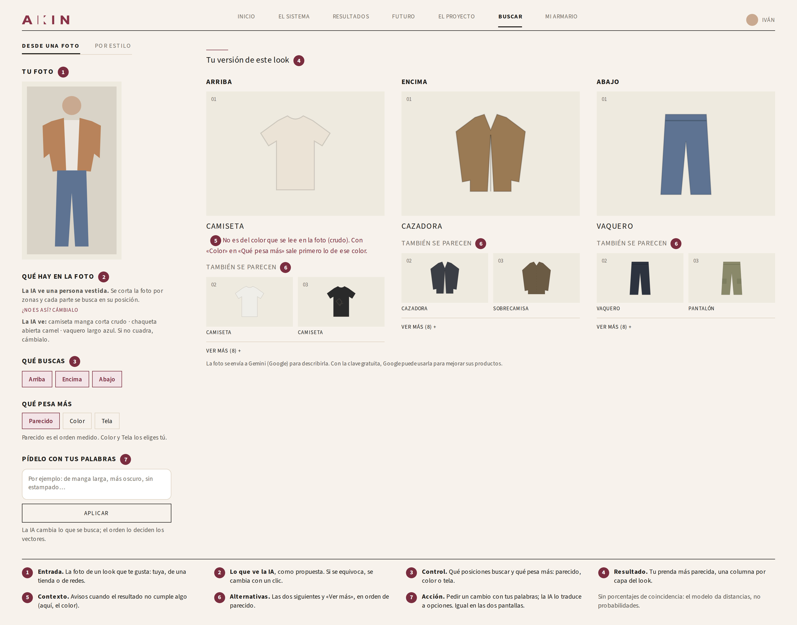
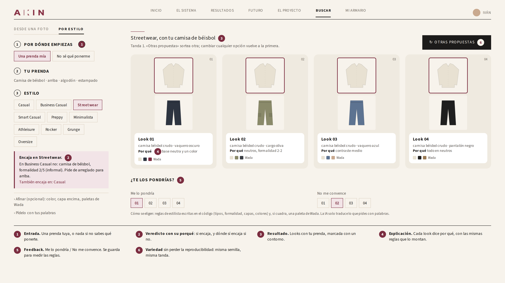

# Entrega 5. Diseño del frontal y experiencia de usuario

**Autor:** Iván Delgado
**Máster en Data Science y Desarrollo de IA, Evolve Academy**
**Fecha:** septiembre de 2026

> **Nota de trazabilidad.** Esta entrega llega tarde y con ventaja: cuando la escribo, el frontal ya está construido (Streamlit, en `app.py` y `paginas/`). Los mockups de abajo están dibujados sobre la estructura real de la app. Las prendas son dibujos y no fotos porque ni las fotos de mi armario ni las de tienda van al repositorio. Donde el diseño cambió respecto a lo que tenía pensado en entregas anteriores, lo digo.

---

## 1. Resumen de la solución y del usuario

**El problema.** Ves un look que te gusta, en una tienda, en Instagram o en la calle, y no sabes si tienes algo parecido en casa. Casi nunca es que te falte ropa: es que no te acuerdas de la que tienes, o no la asocias con lo que estás viendo porque "no es igual". Y las apps de moda que existen están hechas para venderte la prenda, no para que uses la tuya.

**El usuario.** Un chico con un armario normal (del orden de cien prendas) que quiere vestir mejor con lo que ya tiene. No sabe nada de modelos ni de vectores y no tiene por qué.

**La tarea concreta.** Dos preguntas que se hace delante del armario:

1. *"Tengo esta foto. ¿Qué me pongo de lo mío para ir parecido?"*
2. *"Me quiero poner esta prenda. ¿Vale para este estilo? ¿Con qué la combino?"*

**Tipo de producto.** Un **recomendador por recuperación**. No predice ni clasifica: ordena las prendas del propio usuario por parecido a una referencia (función 1) y monta conjuntos con reglas explícitas (función 2). No es un dashboard.

**Resultado principal.** Su propia prenda más parecida para cada parte del look (arriba, encima, abajo), con alternativas ordenadas. En la segunda función, varios looks con su prenda y un veredicto de si encaja en el estilo y por qué.

---

## 2. Mockup del frontal

Pantalla principal: **Buscar → Desde una foto**.

Se lee de izquierda a derecha, que es el orden en que se usa:

- **A la izquierda, lo que pones tú** (1-3 y 7). La foto de referencia, lo que la IA ha visto en ella (como propuesta, con un «¿No es así? Cámbialo»), dos controles (qué partes buscar y qué pesa más en el orden) y, al final, «Pídelo con tus palabras».
- **A la derecha, lo que te devuelve** (4-6). Una columna por capa del look. Arriba de cada columna, tu prenda más parecida, en grande; debajo, las dos siguientes y un «Ver más». Si el resultado no cumple algo que se ve en la foto, lo dice debajo (5).
- **Al final del panel, lo que puedes hacer después** (7). Pedir un cambio con tus palabras («de manga larga», «más oscuro») y volver a buscar. Esta caja es igual en las dos pantallas, con el mismo nombre, el mismo sitio y el mismo botón, para que se aprenda una vez.

Pantalla secundaria: **Buscar → Por estilo**, la segunda función.

Tres pasos numerados a la izquierda (por dónde empiezas, tu prenda, el estilo) y el veredicto justo debajo. A la derecha, los looks, cada uno con su «Por qué», y la valoración «Me lo pondría / No me convence». Si un look lleva una sudadera o un jersey, incluye también la camiseta que va debajo, marcada como «Debajo».

**Sistema visual.** Lo saqué midiendo, no de memoria: inspeccioné las webs de Zara, Pull&Bear y Bershka con las herramientas del navegador (estilos calculados, tamaños, variables CSS) y me quedé con lo que tienen en común (`docs/sistema_visual.md`):

- una sola familia sans-serif, filetes de 1 px y nada de sombras;
- la foto de la prenda manda y la interfaz se aparta;
- el estado activo se marca con peso tipográfico, no con color.

La paleta es la del chatbot que hice en el módulo de IA Generativa, para que los dos proyectos del máster se lean como el mismo producto: beige `#F7F3EC` de fondo, negro `#1C1B1A` para el texto y burdeos `#7B2D40`. El beige es neutro a propósito, porque el color lo pone la ropa.

La primera versión del mockup, de antes de construir la app, sigue en `docs/assets/05_mockup_frontal_v1.png`. Buscaba una sola prenda contra el armario y la ordenaba en dos bandas de confianza. Al construir la app lo cambié a una columna por capa del look (ver el apartado 5).

---

## 3. Justificación del diseño

### 3.1. Utilidad y valor de la solución

**Qué decisión mejora.** La de qué ponerte con lo que tienes. Sin la app, la haces tú de memoria, prenda por prenda, y lo normal es que se te escape la mitad del armario. Con la app subes una foto y en unos segundos tienes tus tres mejores candidatas para cada parte del look.

**Qué ahorra.** Tiempo delante del armario y, sobre todo, compras repetidas: comprar algo que ya tienes en otro color porque no te acordabas de ello. Que la app empiece por lo que ya has pagado es la idea del producto (*"No te vende nada. Te enseña lo que ya tienes"*).

**Qué información es esencial.** La foto de tu prenda, grande, y su tipo. Es lo que necesitas para decidir si te sirve. Todo lo demás está en segundo plano.

**Qué decidí no enseñar, y por qué:**

- **Ningún porcentaje de coincidencia.** El modelo da distancias coseno, no probabilidades, y un "92 % de coincidencia" sería inventado. Lo medí: en la banda más alta de parecido, solo 26 de cada 100 resultados comparten el atributo consultado (`docs/resultados_calibracion.md`). Un 92 % en pantalla sería mentira.
- **Ninguna cifra de similitud.** En mi armario dos prendas distintas ya salen a 0,93 de coseno y dos fotos de la misma prenda a 0,99. Todo cae en un margen de 0,05-0,07. Enseñar tres decimales aparenta una precisión que no hay. El orden sí dice algo, y por eso se enseña el orden.
- **Nada sobre si te favorece.** No hay datos públicos para eso, y un modelo entrenado con juicios estéticos sobre cuerpos aprende sesgos sí o sí. Lo descarté desde la primera entrega. La altura, si la das, activa una sola regla de proporción que se ve y se puede quitar. El peso no se pide.
- **Nada de precios, favoritos ni cesta.** No hay nada que vender.

**Cómo se convierte el resultado en algo útil.** El modelo devuelve una lista ordenada de vectores. La pantalla lo convierte en "esta es tu camiseta más parecida, estas dos también, y ojo, que no es del mismo color". Así pasa de ranking a decisión.

### 3.2. Flujo de usuario

Recorrido principal (función 1, Desde una foto):

1. **Entrada.** El usuario entra con su correo. Si su armario está vacío, la app le manda primero a *Mi armario*: sin prendas no hay nada que buscar.
2. **Digitalizar el armario (una vez).** En *Mi armario* sube fotos de sus prendas, de una en una o varias de golpe (hasta 40). Gemini propone tipo, color, tejido, manga y estampado, y el usuario corrige lo que esté mal. Lo que pone el usuario manda sobre la IA.
3. **Subir la referencia.** En *Buscar* arrastra la foto de un look.
4. **Confirmar lo que ve la IA.** La app dice si ve una persona vestida o una prenda suelta, y qué piezas lleva. Si se equivoca, se cambia con un clic.
5. **Elegir qué buscar y qué pesa más.** Por defecto, todo lo que hay en la foto y el orden por parecido.
6. **Procesamiento** (no se ve). La foto se corta por zonas y por capas. Cada zona pasa por CLIP ViT-B/32 congelado y por la proyección de 128 dimensiones que entrené con DeepFashion, y se compara por coseno solo con las prendas del usuario de esa posición. Antes del parecido van el tipo, la manga y el largo. Ningún LLM decide el orden.
7. **Resultado.** Una columna por capa, con la mejor candidata, dos alternativas y «Ver más».
8. **Acción.** Quedarse con lo que sale, mirar más opciones, cambiar a orden por color o por tela, o pedir un cambio con palabras en «Pídelo con tus palabras».

Función 2 (Por estilo): eliges una prenda tuya (o «No sé qué ponerme»), eliges estilo, y recibes un veredicto y 8 looks. «Otras propuestas» saca otra tanda, y cada look se puede valorar.

**Excepciones:**

| situación | qué hace la app |
|---|---|
| El armario está vacío | Te lleva a *Mi armario* antes de buscar. |
| No tienes prendas de una posición | La columna lo dice: «No tienes prendas de esta posición. Añádelas en Mi armario». No se rellena con prendas de otra parte del cuerpo. |
| La IA ve mal la foto | Todo lo que dice la IA sale como propuesta y se puede cambiar. |
| Gemini no responde (sin clave, sin red, cuota agotada) | La app sigue funcionando: en vez de decírtelo la IA, te pregunta qué hay en la foto. La subida de varias fotos de golpe avisa de que ahora no está disponible y deja subirlas una a una. |
| El resultado no cumple algo visible | Aviso debajo de la prenda (por ejemplo, el color), con la forma de arreglarlo. |
| La prenda no encaja en el estilo | Veredicto «No encaja», con la causa y los estilos donde sí encaja. El look solo se monta si lo pides, y cada tarjeta lleva «No cumple X». |
| Texto que no es una petición de ropa | «No lo he entendido como una petición de ropa.» |

La columna vacía es una decisión, no un fallo. Rellenarla con las diez prendas "menos lejanas" daría una lista que no se parece a nada, y el usuario pensaría que el sistema es malo cuando lo que falta es ropa. Es mejor decir que no hay y decir qué hacer.

### 3.3. Experiencia de usuario

- **Jerarquía visual.** Lo primero que se ve es tu prenda, grande. Luego las alternativas, más pequeñas. Los controles quedan a la izquierda y en gris.
- **Simplicidad.** Por defecto no hay que tocar nada: subes la foto y ya sale un resultado. Lo opcional va plegado («Afinar»). En *Por estilo* los pasos van numerados porque en una versión anterior se hacía lioso.
- **Consistencia.** Elegir no es lo mismo que actuar. Las opciones marcadas van en burdeos claro y los botones que hacen algo, en negro. Antes el mismo negro servía para las dos cosas y confundía. Tampoco hay verde ni rojo de "bien/mal", porque el modelo no sabe eso.
- **Contexto y confianza.** No hay porcentajes, pero sí contexto. Cada look dice «Por qué», con las mismas reglas que lo montaron. El veredicto nombra la causa («Camisa de béisbol: formalidad 2/5»). Y el aviso de color dice cuándo la mejor candidata no es del color de la foto.
- **Control del usuario.** Todo lo que viene de la IA se puede cambiar: el tipo de prenda al subirla, lo que ve en la foto de referencia y la traducción de una petición en texto. Las notas del usuario mandan sobre lo que ve la IA. La regla de altura se puede apagar.
- **Feedback del sistema.** Hay indicadores de carga mientras se analiza la foto. La subida de varias fotos termina con un resumen de cuántas se añadieron y cuáles no se reconocieron. Borrar la cuenta pide la contraseña y una casilla de «Entiendo que no se puede deshacer».
- **Honestidad con la IA.** La subida de varias fotos lo avisa antes de empezar: la IA no es perfecta (acertó el tipo de prenda en 105 de mis 118) y conviene revisar cada prenda. La página de Buscar dice que la foto se envía a Google.
- **Accesibilidad.** Medí el contraste contra WCAG 2.1 AA, que pide 4,5:1 para texto normal. Todos los colores de texto cumplen sobre el beige:

  | elemento | color | ratio |
  |---|---|---|
  | texto principal | `#1C1B1A` | 15,55 |
  | texto secundario | `#5A5651` | 6,58 |
  | rótulos pequeños | `#756E66` | 4,54 |
  | navegación inactiva | `#786E61` | 4,52 |
  | burdeos | `#7B2D40` | 8,29 |

  Dos de estos colores los tuve que oscurecer al medirlos: los rótulos estaban en 2,97 y la navegación en 1,96. A ojo parecían legibles. Por eso lo medí en vez de suponerlo.

  No he evaluado la navegación por teclado ni los lectores de pantalla, y algunos rótulos son pequeños aunque el contraste cumpla. Está pensada para ordenador; en móvil se ve, pero no la he adaptado.

---

## 4. Presentación de resultados y explicabilidad

**Resultado principal.** Una lista ordenada de prendas del usuario para cada posición del look, de la que se enseña la primera en grande y las dos siguientes.

**Qué ayuda a interpretarlo:**

- **La posición y el tipo.** Cada columna dice qué parte del look es y qué tipo de prenda has encontrado.
- **Avisos concretos.** Cuando la mejor candidata no es del color que se ve en la foto, lo dice, y dice cómo pedir que el color pese más.
- **En Por estilo, el porqué.** Cada look lista las razones (base neutra y un color, poco contraste arriba-abajo, paleta de Wada…), y el veredicto da la causa con la formalidad de la prenda.
- **En Mi armario, el detalle.** La ficha de cada prenda enseña su formalidad (n/5) y qué la mueve, para que el usuario vea por qué una prenda no sale en un estilo.

**Cómo evito que una estimación parezca una certeza:**

- no hay porcentajes ni cifras de similitud (ver 3.1);
- siempre hay alternativas, nunca una sola respuesta;
- lo que dice la IA sale como propuesta ("La IA ve…"), no como un hecho;
- si un look se salta las reglas del estilo porque el usuario lo ha pedido, la tarjeta lo dice.

**Qué se queda fuera de la pantalla principal.** Todo lo técnico: los números del modelo, las métricas y cómo se calibró. Está en las páginas *El sistema* y *Resultados* de la propia app, con los resultados buenos y los malos, para quien quiera mirarlo.

### IA generativa

**Sí la uso, y para tres cosas concretas**, todas con Gemini 3.5 Flash-Lite y respuestas en JSON con listas cerradas:

1. **Describir fotos.** Al subir una prenda: tipo, color, tejido, manga, largo, estampado y 13 rasgos de sí/no (capucha, cargo, gráfico grande…). En la referencia: si hay una persona y qué piezas lleva, por capas.
2. **Traducir texto a opciones.** «Una cena informal, algo en azul» se convierte en {estilo, color, capa}, y esas opciones se ven marcadas en la pantalla y se pueden cambiar.
3. **Ajustar una búsqueda.** «Pídelo con tus palabras» traduce «de manga larga» a un cambio en los filtros, y en *Por estilo* «ropa de verano» a manga corta y abajo corto.

**Lo que no hace nunca es decidir.** No elige qué prenda sale, ni en qué orden, ni qué look se monta. Eso lo deciden los vectores y unas reglas escritas en el código, porque tiene que ser reproducible y evaluable. Si le preguntas dos veces a un modelo de lenguaje, te puede contestar distinto: su formalidad global solo coincide consigo misma en 20 de 30 fotos. Los rasgos concretos coinciden en 27-30 de 30, y por eso uso los rasgos y no su juicio.

**Tampoco genera explicaciones.** Los «Por qué» de cada look no los escribe un LLM: salen de las mismas reglas que montan el look. Así no puede inventarse una causa, y lo que se explica es exactamente lo que se ha hecho.

**Trazabilidad.** Lo que dice la IA se guarda en una caché (`data/etiquetas_cache.json`), por foto y versión de instrucciones, así que el mismo armario da el mismo resultado. Y lo he medido contra mis anotaciones a mano: tipo 105/118, manga 25/27, persona en foto de modelo 24/24.

---

## 5. Alcance del MVP

**Implementado y funcionando** (Streamlit, Python):

- cuentas de usuario, cada una con su armario (SQLite), perfil, foto y borrado de cuenta;
- Mi armario: subir prendas de una en una o varias de golpe, con propuesta de la IA, editar detalles y categorías;
- Buscar desde una foto: persona o prenda suelta, por capas, con orden por parecido, color o tela, y ajuste con palabras;
- Buscar por estilo: 10 estilos, veredicto con causa, 8 looks por tanda, paletas de Wada, regla de altura opcional;
- valoraciones «Me lo pondría / No me convence» guardadas desde el primer día;
- páginas que explican el sistema, los resultados y los límites.

**Diseñado pero no construido:**

- **Catálogo comercial y enlace a producto.** Cuando no tienes nada parecido, buscarlo en una tienda. Quedó fuera del núcleo por decisión de alcance (entrega 4).
- **Compatibilidad aprendida con Polyvore.** Hoy los looks salen de reglas. Hacerlo con un modelo entrenado era demasiado para el tiempo que había.
- **Correos** de confirmación y recuperación de contraseña. Necesitan un servidor de correo y no aportan nada a lo que se evalúa.
- **Servicio aparte (FastAPI) y PostgreSQL con pgvector.** Con un armario de cien prendas por usuario, comparar una a una tarda milisegundos, así que SQLite basta. El esquema es el de la entrega 3 y se puede migrar.

**Lo que cambió respecto a lo planeado.** En la entrega 2 el frontal iba a ser una búsqueda de una prenda contra el armario. La versión final busca un look entero por capas, porque así es como se usa de verdad: la foto que te gusta casi nunca es de una sola prenda. Y la segunda función, *Por estilo*, pasó de "móntame algo" a "¿vale esta prenda mía para este estilo?", porque es la pregunta que me hacía yo al probarla.

Creo que el diseño es ambicioso en lo útil (un armario entero, dos funciones y explicaciones en cada resultado) y realista en lo técnico: todo lo que se ve en los mockups está funcionando, y lo que no está funcionando está marcado como trabajo futuro en la propia app.
